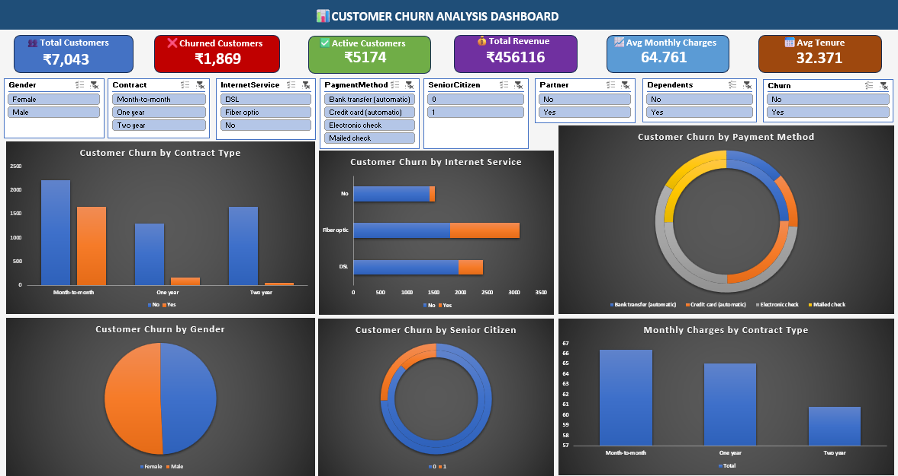

# 📊 Telco Customer Churn Dashboard (Excel)

An interactive Microsoft Excel dashboard for analyzing customer churn in a telecom company using Pivot Tables, Charts, KPIs, and Slicers.

## 📌 Project Overview

This project analyzes customer churn data to help businesses understand customer behavior, identify churn patterns, and make data-driven decisions. The dashboard provides an interactive way to explore key performance indicators and customer demographics.

## 🎯 Objectives

* Analyze customer churn trends.
* Identify factors influencing customer churn.
* Compare churn across contract types.
* Analyze payment methods and internet services.
* Present business insights through an interactive dashboard.

## 🛠️ Tools Used

* Microsoft Excel
* Pivot Tables
* Pivot Charts
* Slicers
* KPI Cards
* Conditional Formatting

## 📈 Dashboard Features

* ✅ Total Customers
* ✅ Churn Count
* ✅ Active Customers
* ✅ Average Monthly Charges
* ✅ Average Tenure
* ✅ Contract Type Analysis
* ✅ Gender-wise Analysis
* ✅ Internet Service Analysis
* ✅ Payment Method Analysis
* ✅ Interactive Filters (Slicers)

## 📂 Files

| File                                                                            | Description              |
| ------------------------------------------------------------------------------- | ------------------------ |
| 📊 [Telco_Customer_Churn_Dashboard.xlsx](./Telco_Customer_Churn_Dashboard.xlsx) | Complete Excel Dashboard |
| 🖼️ [dashboard.png](./dashboard.png)                                            | Dashboard Preview        |
| 📁 [telco_customer_churn.csv](./data/telco_customer_churn.csv)                  | Dataset (Optional)       |

## 🖼️ Dashboard Preview

> Upload a screenshot named **dashboard.png** to your repository, then it will automatically appear below.

```markdown


## 💡 Key Insights

* Customers with **Month-to-Month contracts** have the highest churn rate.
* **Fiber Optic** users show higher churn compared to other internet services.
* Customers using **Electronic Check** are more likely to churn.
* Long-term contracts significantly improve customer retention.

## 🚀 Skills Demonstrated

* Data Cleaning
* Data Analysis
* Dashboard Design
* Business Intelligence
* Data Visualization
* KPI Reporting
* Excel Automation
* Analytical Thinking

## 📷 Repository Structure

```
telco-customer-churn-dashboard/
│
├── README.md
├── Telco_Customer_Churn_Dashboard.xlsx
├── dashboard.png
├── data/
│   └── telco_customer_churn.csv
└── screenshots/
```

## 👨‍💻 Author

**Akash Pindi**

* GitHub: https://github.com/YourUsername
* LinkedIn: https://linkedin.com/in/YourLinkedIn

⭐ If you found this project useful, consider giving it a **Star** on GitHub!
